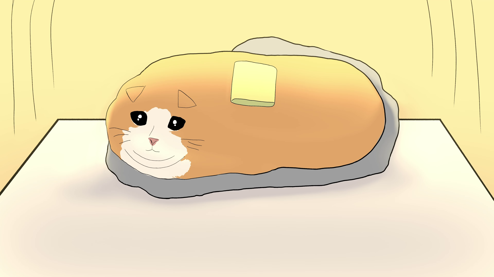

# ButterOS

Here I could write something useful... naahhh

## Todo

- Install & see what packages can be removed
- Enable Smartcard support
- Make xsecurelock work with smartcards or find another lock screen
- Create standard set of apps for:
  - Spreadsheets
  - Audio Setup & Control
  - Temp & Fan monitoring
  - General use (Calculator and other things... maybe)
- Harden Config:
  - Firewall
  - Backdoor ssh on diffrent port with cert auth to root account
  - Network monitoring
  - Secure Backups
  - User encrypted home (PIV)
  - Update config to pass [Standard System Security Profile for Fedora][scap]

[scap]: https://static.open-scap.org/ssg-guides/ssg-fedora-guide-standard.html